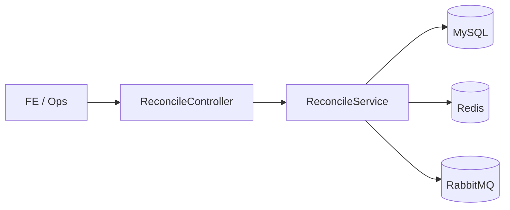

# settlemate-be

[](https://github.com/settlemate-labs/settlemate-be/actions/workflows/ci.yml)

가맹점 정산 요청을 받아 환불 이상치와 지급 가능 금액을 계산하는 Kotlin/Spring API입니다.

## 도메인 맥락

정산 API는 지급 가능 금액을 계산하는 동시에 환불 이상치를 잡아야 합니다. SettleMate BE는 환불 비율이 높은 정산을 `held`로 분기하고 정상 요청만 `cleared`로 처리합니다.

## API

| Method | Path | 설명 |
| --- | --- | --- |
| `GET` | `/api/dashboard` | 정산 대시보드 요약 |
| `POST` | `/api/settlements` | 정산 결과 계산 |

## 판단 기준

- 환불 금액이 매출의 25%를 넘으면 `refund-spike`
- 정상 정산은 `cleared`
- 이상 정산은 `held`

## 기술 스택

- Kotlin, Spring Boot, REST
- MySQL, Redis, RabbitMQ
- Spring Actuator
- JUnit Platform

## 아키텍처



## 실행

```bash
gradle test
gradle bootRun
```

샘플 요청: [`requests.http`](./requests.http)  
API 계약: [`openapi.yaml`](./openapi.yaml)

## 테스트

- `ReconcileServiceTest`: 정상 정산/환불 급증 보류 검증
- CI: Java 21, Gradle, JUnit Platform
